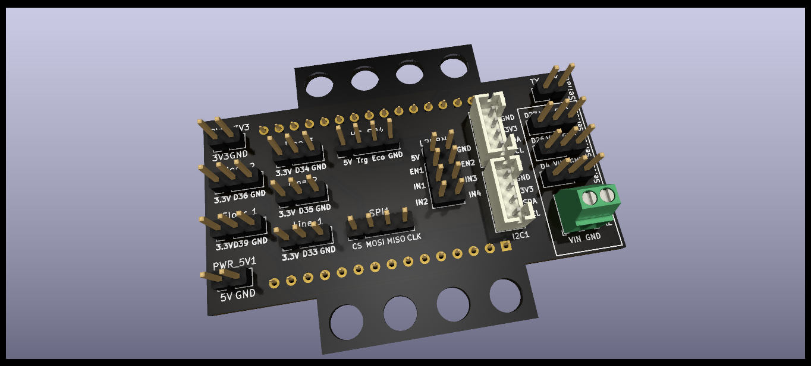
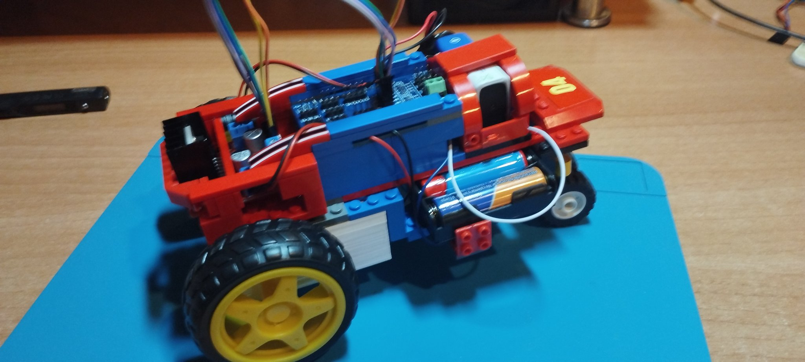

# rover-robot-PCB

## Description

This is a multipurpose PCB for Arduino projects using ESP32. The main objective is to create a board to make robots easily but it can be used also to create different types of DIY projects such as a weather station. 

It could be programmed using PlatformIO, Pictoblox, Arduinoblocks, etc. Then, it can be mounted in a structure made of universal/compatible toy bricks. This makes this board a good option for educational purposes with kids.

Currently I'm working on a remote controlled vehicle programmed in Pictoblox. I'm constantly modifying the design and you can follow the updates in my X account: 

## Future

This repository will contain the latest version of the PCB and soon, examples of source code for robots, remote controlled vehicles and perhaps other kind of inventions.